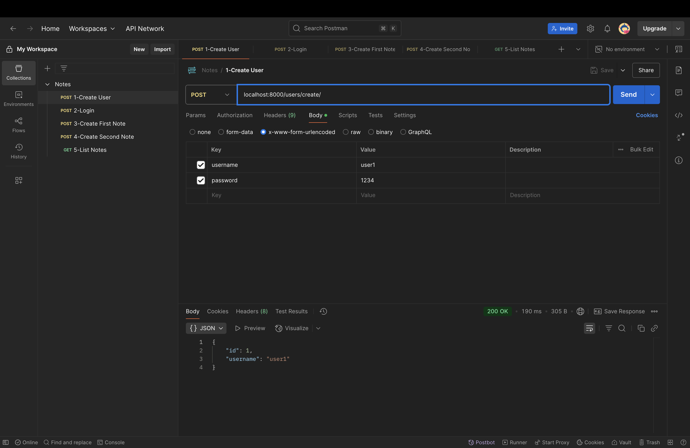

# گزارش آزمایش

##  محتوای فایل Dockerfile

وظایف Dockerfile به صورت زیر است:
- تعریف نحوه ساخت محیط اجرایی پروژه Django به صورت خودکار در قالب یک Docker image.
- این فایل مشخص می‌کند که از چه پایه‌ای (Python 3.11) استفاده شود، چه فایل‌هایی کپی شوند، دیپندنسی‌ها چطور نصب شوند، و برنامه چگونه اجرا شود.


```Dockerfile
FROM python:3.11

WORKDIR /app

COPY . .

RUN pip install -r requirements.txt

CMD ["sh", "-c", "python manage.py migrate && python manage.py runserver 0.0.0.0:8000"]
```

---
### `FROM python:3.11`

- این خط مشخص می‌کند که محیط اجرایی کانتینر شامل Python 3.11 خواهد بود.

---
### `WORKDIR /app`

- مسیر کاری داخل کانتینر را به دایرکتوری `/app` تغییر می‌دهد.
- تمامی دستورات بعدی در این دایرکتوری اجرا خواهند شد.

---

### `COPY . .`

- تمام فایل‌ها و دایرکتوری‌های موجود در مسیر فعلی پروژه را به مسیر کاری داخل کانتینر (یعنی `/app`) کپی می‌کند.

---

### `RUN pip install -r requirements.txt`

- تمام کتابخانه‌ها و وابستگی‌های پروژه را که در فایل `requirements.txt` لیست شده‌اند نصب می‌کند.
- در پروژه ما شامل Django و psycopg2-binary است.

---

### `CMD ["sh", "-c", "python manage.py migrate && python manage.py runserver 0.0.0.0:8000"]`

- این دستور هنگام اجرای کانتینر اجرا می‌شود.
- ابتدا مایگریشن‌های دیتابیس را اعمال می‌کند و سپس برنامه Django را روی آدرس داده شده راه‌اندازی و اجرا می‌کند.

---


## محتوای docker-compose.yaml


وظایف این فایل به صورت زیر است:

- هماهنگ‌سازی اجرای چند سرویس مرتبط (Django و PostgreSQL) در قالب یک محیط.
- تعریف تنظیمات مربوط به هر سرویس و ساده‌سازی فرایند اجرای پروژه تنها با یک دستور `docker compose up`.


```yaml
version: '3.9'

services:
  db:
    image: postgres:17.0
    volumes:
      - postgres_data:/var/lib/postgresql/data/
    environment:
      POSTGRES_DB: notes
      POSTGRES_USER: user
      POSTGRES_PASSWORD: password

  web:
    build: .
    ports:
      - "8000:8000"
    depends_on:
      - db
    environment:
      DB_HOST: db
      DB_PORT: 5432
      DB_NAME: notes
      DB_USER: user
      DB_PASSWORD: password

volumes:
  postgres_data:
```

---

### ️ سرویس `db`
- اجرای PostgreSQL نسخه 17 با تعریف متغیرهای محیطی:
  - `POSTGRES_DB`: نام دیتابیس اولیه
  - `POSTGRES_USER`: نام کاربر پایگاه‌داده
  - `POSTGRES_PASSWORD`: رمز عبور
- استفاده از volume برای ذخیره‌سازی پایدار داده‌ها.

---

###  سرویس `web`
- ساخت ایمیج پروژه Django با استفاده از Dockerfile موجود در دایرکتوری فعلی.
- اتصال به دیتابیس با استفاده از متغیرهای محیطی.
- نگاشت پورت 8000 از کانتینر به پورت 8000 هاست.

---

###  Volumes
- Volume با نام `postgres_data` برای حفظ داده‌های PostgreSQL حتی پس از توقف کانتینر تعریف شده است.


## اجرای برنامه و تعامل با داکر

با دستور `docker compose up -d` برنامه را استارت می‌کنیم.


مشاهده می‌شود که ایمیج ساخته می‌شود و اپلیکیشن و سرویس پایگاه‌داده آغاز به کار می‌کنند.
 همانطور که در دستور `docker ps` کانتینر های درحال اجرا را دیدیم از هر ایمیج یک کانیتر در حال اجرا است و از برنامه وب پورت ۸۰۰۰ اکسپوز شده است.


در تصویر زیر لیست ایمیج ها را مشاهده‌می‌کنیم که همانطور که پیداست postgres و aznarm6-web از ایمیح های مورد استفاده ما هستند. همچنین ایمیج aznarm6-web از ایمیج python ساخته شده است.


به درون کانتینر وب سرور می‌رویم و کامند های مختلفی را ران می‌کنیم که مشاهده‌ می‌شود در یک محیط ایزوله که برنامه درحال ران هست هستیم و می‌توانیم مثل هر سروری دستوراتمان را ران کنیم. فایل های پروژه نیز با دستور کپی داکرفایل همه در اینجا قرار دارند و پروژه درحال اجرا است. 


حال با Postman، به کار با اپلیکیشن می‌پردازیم:

ابتدا یک کاربر با نام user1 و پسورد 1234 می‌سازیم. مشاهده می شود که ۲۰۰ برگردانده شد و یوزر ساخته شده است.


لاگین می‌کنیم در کاربر و مشاهده می‌شود ۲۰۰ برگردانده شد و کوکی ها ست شد.


یک نوت با title1 و body1 می‌سازیم.


یک نوت با title2 و body2 می‌سازیم.


در آخر لیست نوت های کاربر را می‌گیریم که مشاهده می‌شود دو نوت کاربر برگردانده شده است.


## پرسش ها

1. وظایف Dockerfile، image و container را توضیح دهید.

- Dockerfile: 

-فایلی متنی است که مجموعه‌ای از دستورها را برای ساخت یک image داکر تعریف می‌کند. این فایل مشخص می‌کند که از چه محیط پایه‌ای استفاده شود، چه فایل‌هایی کپی شوند، چه بسته‌هایی نصب شوند، و هنگام اجرای کانتینر چه فرمانی اجرا شود.
- Docker Image:
 
یک snapshot از محیط نرم‌افزاری است که شامل سیستم‌عامل پایه، برنامه و وابستگی‌های آن است. Image تغییرناپذیر است و می‌تواند بارها برای ساخت کانتینرهای مختلف استفاده شود.

- Docker Container:
 
یک instance فعال از یک image است. در واقع، کانتینر محیط اجرایی زنده‌ای است که بر اساس یک image اجرا شده و می‌توان در آن کد را اجرا، فایل ایجاد یا حتی ارتباط شبکه برقرار کرد.
